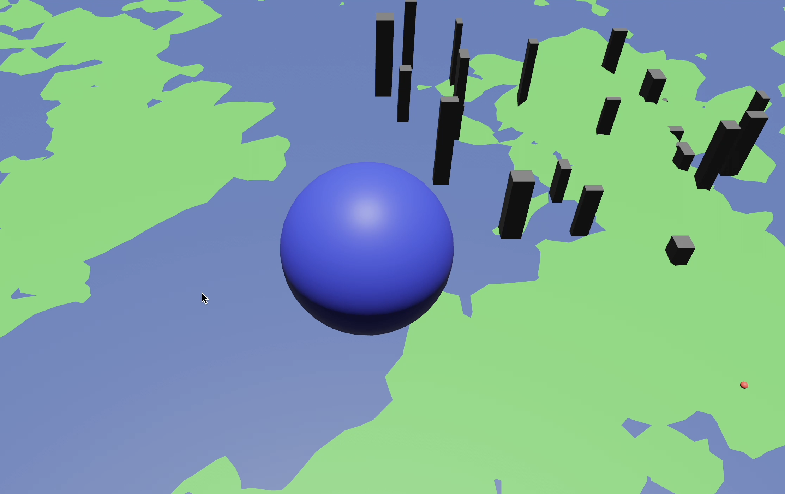

# Spies of Perlin
This is just a fun project to familarize myself with Bevy. This should eventually do ray-casting to do raster scans of terrain under a simulated AWACS plane.

## Status
 - Procedural terrain generation mostly finished (normals default to +Y/up) ✅
 - Procedural city generation mostly finished ✅
 - Procedural target generation done ✅
 - Basic player movement ✅
 - Smoothed camera movement following player ✅
